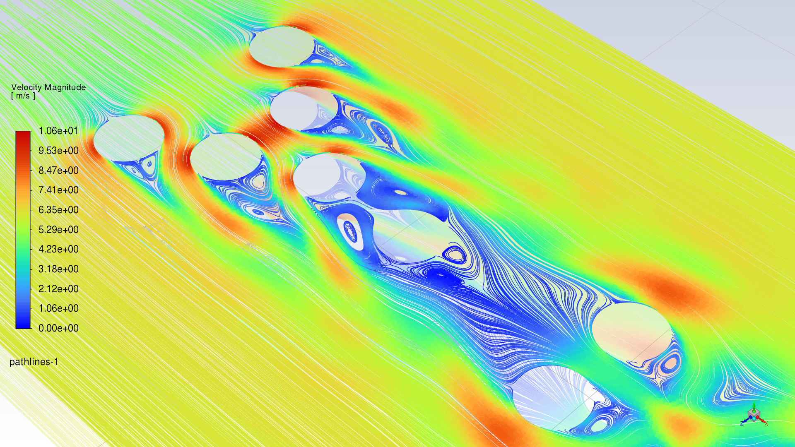

 一点互联网角落的碎碎念/ This is the front page of my website blog.

* 一点随笔/ Random Thoughts
* 学术笔记/ Paper Notes
* 一点电影/ 书籍的观后感 / Movie and Book Reviews
* 以及一些项目/ And some projects

## 📝 最近博文 / Recent Posts


  

  

  



[查看更多博文/ More Posts]({{ site.baseurl }}/year-archive/)

---
## 📝 项目 / Recent Projects

* Aerodynamic Effects of Stretched Formations During Long-Distance Running (Marathons)  

    

 
<a href="../files/paper-file/Aerodynamic Effects of Stretched Formations During Long-Distance Running (Marathons)_Ver_0.02.1.pdf" class="btn btn--info">Download PDF</a>

* Dummy-Robot: Super compact smart robotic-arm  

    

 
<a href="https://github.com/LiuyiRigel/Dummy-Robot" class="btn btn--info">View on GitHub</a>

[//]: (Mood & Alcohol Matrix Visualization - A personal state monitor that maps mood and alcohol levels to a color-coded grid, providing an intuitive visual representation of daily fluctuations. Each cell's color intensity reflects the combined effect of mood and alcohol consumption, allowing for quick insights into patterns and correlations over time.)

  
  

    

      JanFebMarAprMayJunJulAugSepOctNovDec
    

    

      MWFS
    

    

      {% assign year_start = "now" | date: "%Y-01-01" %}
      
        {% assign day_ts = year_start | date: "%s" | plus: 86400 | times: i | plus: 1735689600 %} 
        {% assign date_str = day_ts | date: "%Y-%m-%d" %}
        {% assign dow = day_ts | date: "%u" %}
        

        
           反转映射：M越高越亮(L+), A越高越深(L-) 
          
          
          {% assign color = "hsl(" | append: h | append: ", 40%, " | append: l | append: "%)" %}
          
        
          
          
        
        

      
    

  

  

    
Mood (Psychological)

    
Alcohol Intake (Physiological)

    
    

      
         归一化修复：使用 5% 到 95% 避免边缘切断 
        
        
        

        
        
        {% assign color_dot = "hsl(" | append: h_dot | append: ", 45%, " | append: l_dot | append: "%)" %}

        {{ entry.date }}&#10;M: {{ entry.m }} A: {{ entry.a }}&#10;Note: {{ entry.note }}

        

        

      
    

  

About this page
======
You can fork [this template](https://github.com/academicpages/academicpages.github.io) right now, modify the configuration and Markdown files, add your own PDFs and other content, and have your own site for free, with no ads!

For more info
------
More info about configuring Academic Pages can be found in [the guide](https://academicpages.github.io/markdown/), the [growing wiki](https://github.com/academicpages/academicpages.github.io/wiki), and you can always [ask a question on GitHub](https://github.com/academicpages/academicpages.github.io/discussions). The [guides for the Minimal Mistakes theme](https://mmistakes.github.io/minimal-mistakes/docs/configuration/) (which this theme was forked from) might also be helpful.

