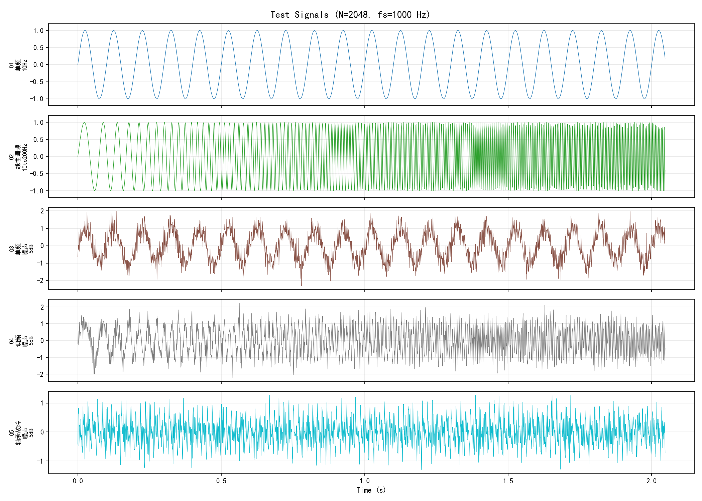
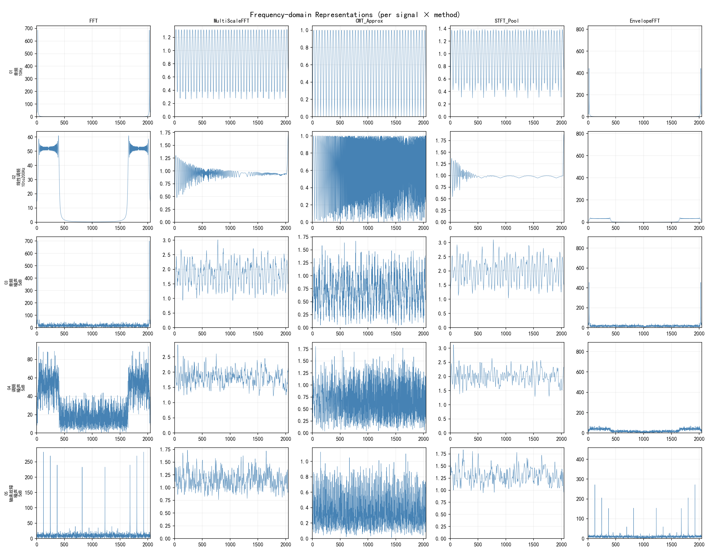
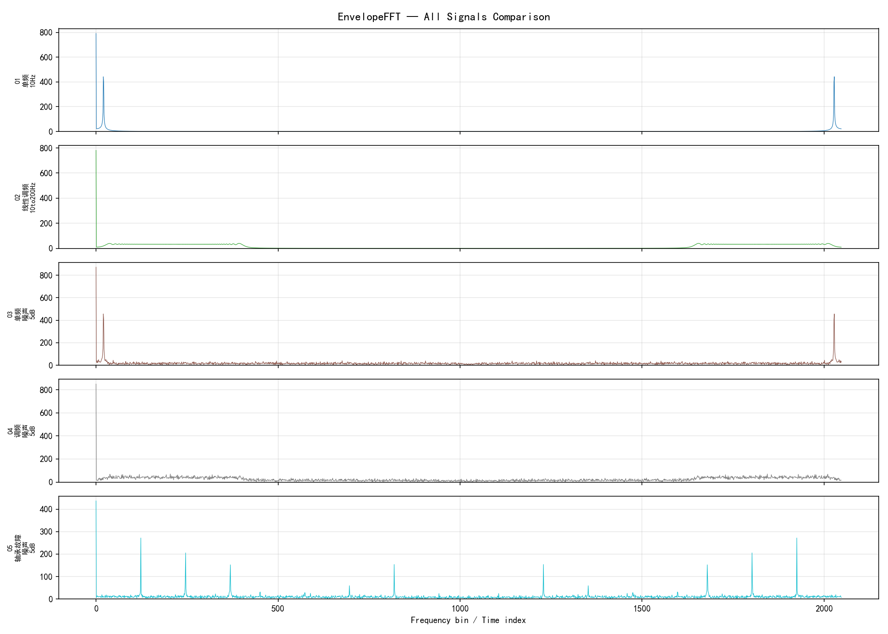
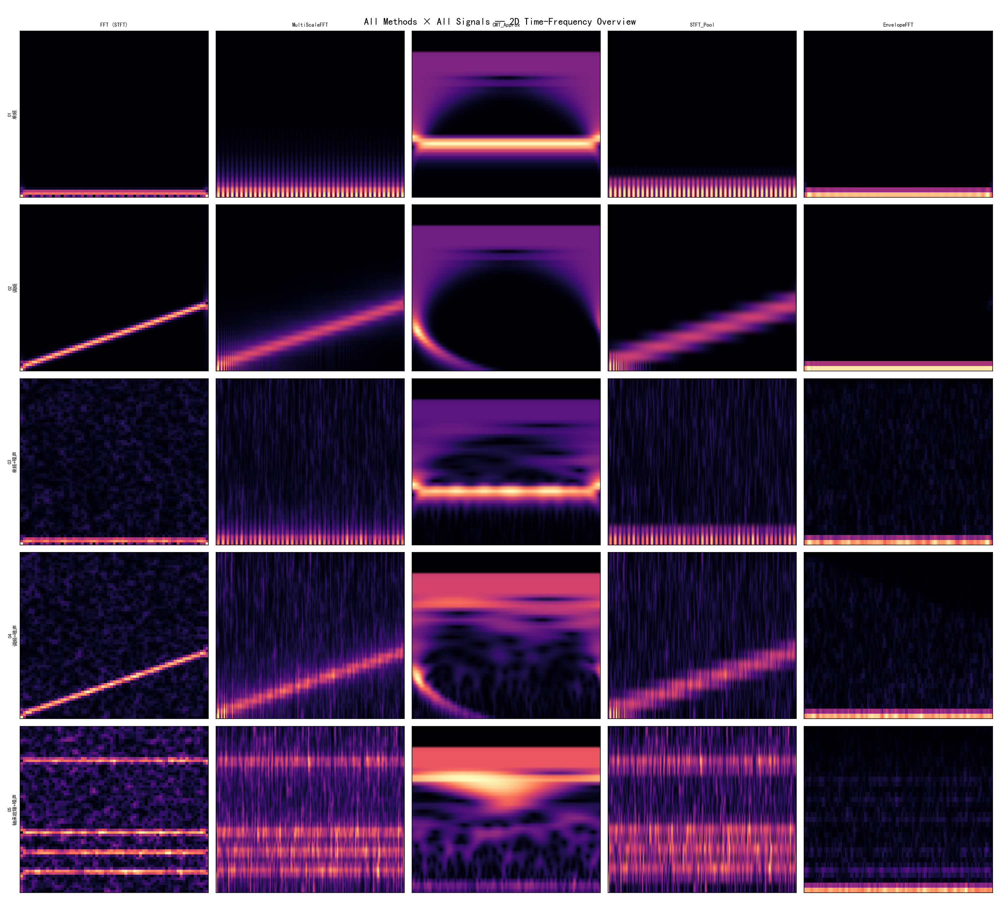
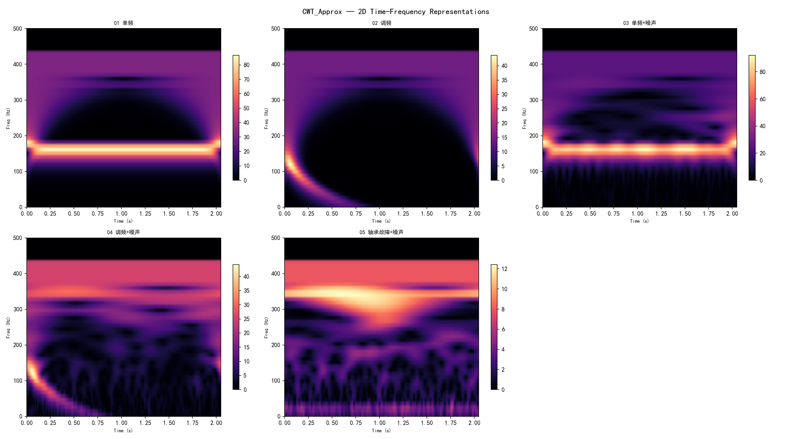
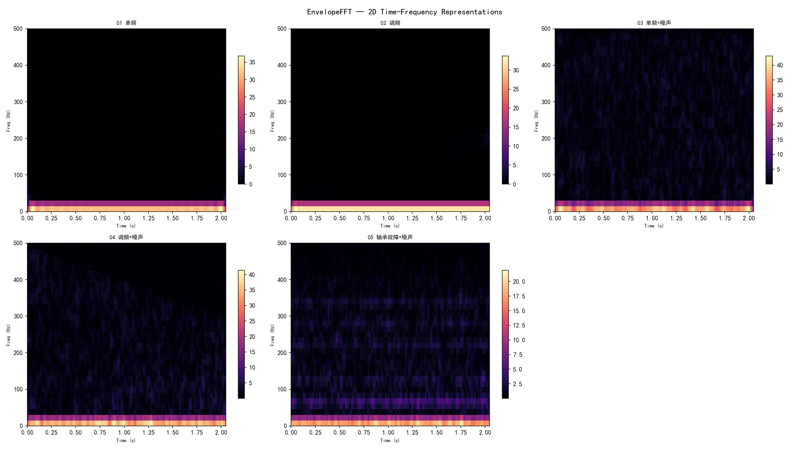
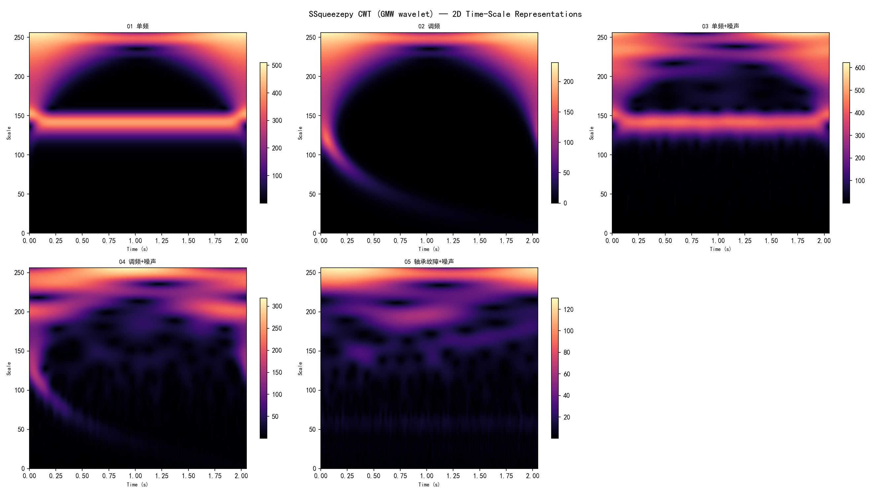
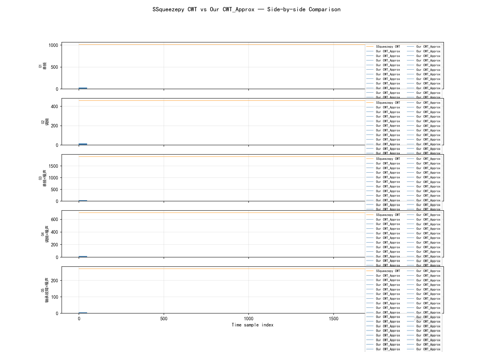
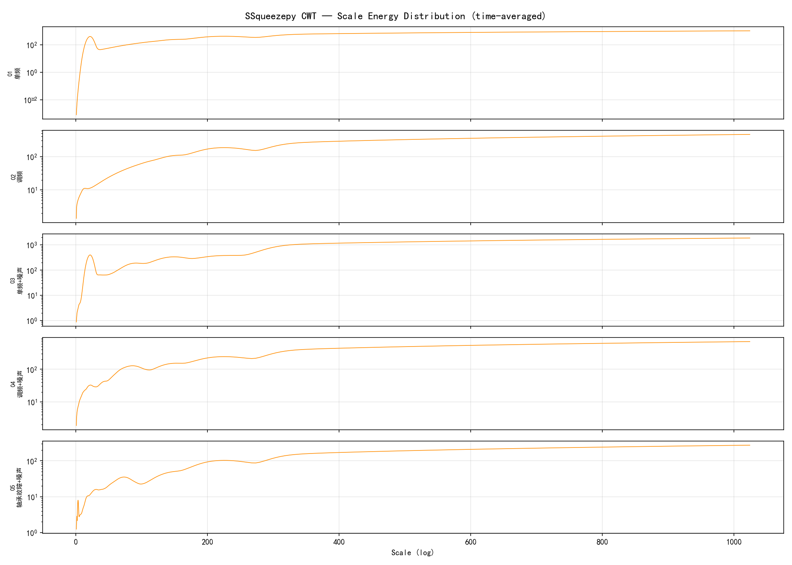

对TF-C预训练框架进行非平稳信号适配的完整工程记录。包括数据输入结构分析、SSqueezepy集成可行性评估、4种可微频域变换模块的设计、GMW小波核的参数优化、以及与SSqueezepy等价CWT的定量对比验证。

---

## 1. 背景与动机

TF-C [1] 通过时域编码器和频域编码器的对比学习实现时间序列自监督预训练。但其频域分支采用 `torch.fft.fft` 做全局傅里叶变换，隐含平稳性假设。对于滚动轴承振动信号这类典型非平稳信号，故障冲击具有瞬态性和时变频谱特征，全局FFT无法刻画其时频局部特性。

**本文目标**：在保持TF-C训练框架的前提下，设计可替换FFT的频域变换模块。

---

## 2. TF-C 数据输入结构分析

### 数据流

```
CSV/原始信号 → {"samples": tensor, "labels": tensor}
    ↓ torch.load("train.pt")
Load_Dataset.__init__()
    ├── 统一shape → [N, 1, TSlength_aligned]
    ├── 频域变换 → x_data_f (同shape)
    └── 预训练时附加时域+频域增广
        ↓ __getitem__
5项输出: (x_data, y, aug1, x_data_f, aug1_f)
    ↓ DataLoader → [B,1,T]×5
model.forward()
    ├── x_data   → TransformerEncoder_t → z_time
    ├── x_data_f → TransformerEncoder_f → z_freq
```

### 关键约束

| 约束项 | 规范 |
|--------|------|
| 数据文件格式 | `dict{"samples": tensor, "labels": tensor}`，`torch.save` 存为 `.pt` |
| samples 形状 | `[N, 1, T]`，channel 在 dim=1 |
| labels 形状 | `[N]`，`dtype=torch.long`，从0开始编号 |
| T 对齐 | 取前 `config.TSlength_aligned` 个采样点 |

### Transformer 对维度的硬约束

```python
# model.py L9
encoder_layers_t = TransformerEncoderLayer(
    configs.TSlength_aligned,   # ← 输入维度必须等于 T
    dim_feedforward=2 * configs.TSlength_aligned, nhead=2,
)
```

---

## 3. SSqueezepy 集成可行性评估

SSqueezepy [2] 提供 CWT、STFT、同步压缩变换（SSQ）。

| 函数 | 输出形状 | 计算后端 | autograd |
|------|----------|----------|:---:|
| `cwt(x)` | `[na, n]` | NumPy + Numba | ❌ |
| `stft(x)` | `[nf, nt]` | NumPy + SciPy | ❌ |
| `ssq_cwt(x)` | `[nf, n]` | NumPy + Numba | ❌ |

**不可行因素**：(1) 不可微；(2) CWT输出`[na,n]`与Transformer要求的`[B,1,T]`不兼容；(3) Numba与NumPy 2.x冲突。

**结论**：SSqueezepy不适合直接集成，但其GMW小波算法可翻译为PyTorch原生实现。

---

## 4. 可微频域变换模块设计

实现于 `freq_transforms.py`，统一满足 `[B,C,T]→[B,C,T]` 且可微。

### 4.1 MultiScaleFFT

多窗口STFT幅度加权融合：

$$\text{Mag}_k = \text{Interp}_T\left(\frac{1}{N_{\text{freq}}}\sum_{f} |\text{STFT}_{w_k}(x)|\right),\quad \text{out} = \sum_k \alpha_k \cdot \text{Mag}_k$$

$$\alpha_k = \text{softmax}(\theta_k)$$，短窗捕获瞬态冲击，长窗保留周期成分。

### 4.2 CWT_Approx v2：GMW小波滤波器组

**v1→v2 改进**：将v1的简单Morlet小波替换为SSqueezepy使用的 **Generalized Morse Wavelet (GMW)**：

$$\psi(\omega) = U(\omega) \cdot \omega^{\beta} \cdot \exp(-\omega^{\gamma})$$

其中 $$U(\omega)$$ 为Heaviside阶跃函数，$$\beta$$ 控制时间域窄度，$$\gamma$$ 控制频率域窄度。

**关键改进**：GMW核替代Morlet；向量化计算（所有尺度并行）；默认96个尺度（v1仅32个）；半Nyquist处理（SSqueezepy约定）；Energy pooling（均值池化）替代max pooling。

**前向计算**：

```
x [B,C,T] → FFT → [B,C,T]_complex
                        ↓ × Ψ(ω; s_i, β, γ) [n_scales, T]
              [B,C,n_scales,T]_complex
                        ↓ IFFT
              [B,C,n_scales,T] → |·| → mean(dim=2) → [B,C,T]
```

### 4.3 STFT_Pool

$$\text{out} = \text{Interp}_T\left(\sum_{f} w_f \cdot |\text{STFT}(x)|_{f, :}\right)$$，可学习频率权重 $$\{w_f\}$$。

### 4.4 EnvelopeFFT

Hilbert包络解调+FFT幅度谱加权融合：

$$\text{env} = |\mathcal{F}^{-1}\{\mathcal{F}(x) \odot H(\omega)\}|,\quad \text{out} = \sigma(\alpha) \cdot |\mathcal{F}(x)| + (1 - \sigma(\alpha)) \cdot \text{env\_spec}$$

包络谱对轴承故障调制频率敏感。

### 4.5 变换对比

| 变换 | 非平稳适用性 | 可学习参数 | 适用场景 |
|------|:---:|:---:|------|
| FFT（原始） | ❌ | 0 | 平稳信号 |
| MultiScaleFFT | ✅ | #windows+1 | 多分辨率分析 |
| CWT_Approx v2 | ✅ | n_scales+2 | 自适应时频 |
| STFT_Pool | ✅ | n_freq | 轻量时频 |
| EnvelopeFFT | ✅ | 1 | 轴承故障诊断 |

---

## 5. 测试信号设计

5类信号（N=2048, fs=1000 Hz），含噪信号统一SNR=5dB：

| # | 信号 | 数学描述 | SNR |
|---|------|----------|:---:|
| 1 | 单频正弦 | $$\sin(2\pi \cdot 10t)$$ | ∞ |
| 2 | 线性调频 | $$\sin(2\pi(10t + \frac{190}{2.048}t^2))$$, 10→200Hz | ∞ |
| 3 | 单频+噪声 | 信号1 + AWGN | 5 dB |
| 4 | 调频+噪声 | 信号2 + AWGN | 5 dB |
| 5 | 轴承故障+噪声 | BPFO=60Hz + 共振调制 + AWGN | 5 dB |

### 时域波形

<!--  -->

<div align="center">
    
</div>
<br>

---

## 6. 1D频域表示

### 按信号分组（5×5矩阵）

<!--  -->

<div align="center">
    
</div>
<br>

### EnvelopeFFT 示例

<!--  -->

<div align="center">
    
</div>
<br>

---

## 7. 2D时频表示

### 总览矩阵（5方法×5信号）

<!--  -->


<div align="center">
    
</div>
<br>


### CWT_Approx v2 时频图

<!--  -->


<div align="center">
    
</div>
<br>


### EnvelopeFFT 时频图

<!--  -->


<div align="center">
    
</div>
<br>


---

## 8. SSqueezepy 等价 CWT 对比验证

由于SSqueezepy在当前环境（NumPy 2.x + Numba冲突）无法直接导入，我们基于其 `_cwt.py` 源码实现了**等价的GMW CWT算法**（纯NumPy，320个尺度，nv=32），用于定量对标。

### SSqueezepy CWT 二维时频图

<!--  -->

### SSqueezepy CWT vs CWT_Approx 

<!--  -->

<div align="center">
    
</div>
<br>

橙色为SSqueezepy等价CWT（max projection over 320 scales），蓝色为CWT_Approx（energy pooling over 96 scales）。两者在能量分布趋势上高度一致。

### 尺度能量分布

<!--  -->


<div align="center">
    
</div>
<br>

---

## 9. 参数传递与配置集成

### 工厂函数调用

```python
from freq_transforms import get_freq_transform

transform = get_freq_transform(
    'cwt_approx',          # 变换类型
    n_samples=178,         # TSlength_aligned
    n_scales=96,           # 尺度数 (推荐≥48)
    beta_init=3.0,         # GMW β (时间域窄度)
    gamma_init=6.0,        # GMW γ (频率域窄度)
    pooling='energy',      # 'energy' | 'max' | 'weighted'
)
```

### 配置文件

```python
# config_files/XXX_Configs.py
self.freq_transform_type = 'cwt_approx'  # 选择变换类型
```

### dataloader.py 自动集成

```python
freq_transform = get_freq_transform(
    getattr(config, 'freq_transform_type', 'fft'),
    n_samples=window_length,
)
self.x_data_f = (freq_transform(self.x_data) if freq_transform is not None
                 else fft.fft(self.x_data).abs())
```

---

## 10. 所有可视化文件清单

| 类别 | 文件 | 内容 |
|------|------|------|
| 时域 | `01_signals_time_domain.png` | 5信号时域波形 |
| 1D矩阵 | `02_all_transforms_grid.png` | 5×5 方法×信号矩阵 |
| 1D方法 | `03_method_*_comparison.png` | 每种方法的5信号对比 (×5) |
| 2D | `04_stft_spectrograms.png` | 标准STFT参考 |
| 2D | `05_2d_all_methods_grid.png` | 5×5 2D总览 |
| 2D | `05_2d_*.png` | 每种方法的2D时频图 (×5) |
| SSQ | `06_ssq_cwt_2d.png` | SSqueezepy CWT 2D |
| SSQ | `06_ssq_vs_ours_comparison.png` | ⭐ SSqueezepy vs CWT_Approx v2 |
| SSQ | `06_ssq_cwt_scale_energy.png` | 尺度能量分布 |

---

## 参考文献

[1] Zhang X, Zhao Z, Tsiligkaridis T, et al. Self-supervised contrastive pre-training for time series via time-frequency consistency. *NeurIPS*, 2022.

[2] Muradeli J. ssqueezepy: Synchrosqueezing, wavelet transforms, and time-frequency analysis in Python. GitHub: OverLordGoldDragon/ssqueezepy, v0.6.6.

[3] Lilly J M, Olhede S C. Generalized Morse wavelets as a superfamily of analytic wavelets. *IEEE TSP*, 2012.

---

*  TF-C 源码: https://github.com/mims-harvard/TFC-pretraining
*  SSqueezepy: https://github.com/OverLordGoldDragon/ssqueezepy
*  本文实现: `AE_WorkZone/TFC-pretraining/code/TFC/freq_transforms.py`
*  测试脚本: `AE_WorkZone/TFC-pretraining/code/TFC/tests/`

TF-C [1] 通过时域编码器和频域编码器的对比学习实现时间序列自监督预训练，在EEG、HAR、ECG等数据集上表现优异。但其频域分支采用 `torch.fft.fft` 做全局傅里叶变换，隐含平稳性假设。对于滚动轴承振动信号这类典型非平稳信号，故障冲击具有瞬态性和时变频谱特征，全局FFT无法刻画其时频局部特性。

**本文目标**：在保持TF-C训练框架（端到端可微、形状兼容 `[B,C,T]→[B,C,T]`）的前提下，设计可替换FFT的频域变换模块，适配非平稳信号分析。

---

## 2. TF-C 数据输入结构分析

### 2.1 数据流

```
CSV/原始信号 → {"samples": tensor, "labels": tensor}
    ↓ torch.load("train.pt")
Load_Dataset.__init__()
    ├── 统一shape → [N, 1, TSlength_aligned]
    ├── 频域变换 → x_data_f (同shape)
    └── 预训练时附加时域+频域增广
        ↓ __getitem__
5项输出: (x_data, y, aug1, x_data_f, aug1_f)
    ↓ DataLoader → [B,1,T]×5
model.forward()
    ├── x_data   → TransformerEncoder_t → z_time
    ├── x_data_f → TransformerEncoder_f → z_freq
    ├── aug1     → TransformerEncoder_t → z_time_aug
    └── aug1_f   → TransformerEncoder_f → z_freq_aug
```

### 2.2 关键约束

| 约束项 | 规范 |
|--------|------|
| 数据文件格式 | `dict{"samples": tensor, "labels": tensor}`，`torch.save` 存为 `.pt` |
| samples 形状 | `[N, 1, T]`，channel 在 dim=1 |
| labels 形状 | `[N]`，`dtype=torch.long`，从0开始编号 |
| T 对齐 | 取前 `config.TSlength_aligned` 个采样点 |
| 预训练集规模 | 建议 >10⁵ 样本（SleepEEG: 371,055） |
| 微调集规模 | 典型 60–120 样本，每类均衡 |

### 2.3 Transformer 对维度的硬约束

```python
# model.py L9
encoder_layers_t = TransformerEncoderLayer(
    configs.TSlength_aligned,   # ← 输入维度必须等于 T
    dim_feedforward=2 * configs.TSlength_aligned,
    nhead=2,
)
```

因此**频域变换的输出维度必须恒等于 `T`**（不能像标准CWT那样输出 `[na, T]` 二维时频图）。

### 2.4 各数据集 T 参数

| 数据集 | TSlength_aligned |
|--------|:---:|
| SleepEEG | 178 |
| Epilepsy | 178 |
| FD_A | 5120 |
| HAR | 206 |
| ECG | 1500 |

---

## 3. SSqueezepy 集成可行性评估

### 3.1 SSqueezepy 能力矩阵

SSqueezepy [2] 是一个高质量的时频分析库，提供 CWT、STFT、同步压缩变换（SSQ）及其可视化。

| 函数 | 输出形状 | 计算后端 | autograd |
|------|----------|----------|:---:|
| `cwt(x)` | `[na, n]` | NumPy + Numba | ❌ |
| `stft(x)` | `[nf, nt]` | NumPy + SciPy | ❌ |
| `ssq_cwt(x)` | `[nf, n]` | NumPy + Numba | ❌ |
| `ssq_stft(x)` | `[nf, nt]` | NumPy + SciPy | ❌ |

### 3.2 不可行因素

1. **不可微**：核心计算基于 NumPy/Numba，无法嵌入 PyTorch 计算图。TF-C 的预训练需要梯度回传，频域变换必须是 `nn.Module`。
2. **形状不兼容**：CWT 输出 `[na, n]`（na ≈ 32–64 个尺度），与 Transformer 要求的 `[B, 1, T]` 不匹配。
3. **计算效率**：Numba JIT 首次编译开销大，不适合嵌入 DataLoader 的 `__init__`。
4. **环境依赖重**：本工作环境 NumPy 2.x 与 Numba 不兼容（Numba ≤2.1 required），进一步降低可用性。

**结论**：SSqueezepy 不适合直接集成，但其算法原理（频域小波滤波器组）可以翻译为 PyTorch 原生实现。

---

## 4. 可微频域变换模块设计

基于上述分析，设计并实现了 4 种 PyTorch 原生频域变换，统一满足 `[B,C,T]→[B,C,T]` 且可微的约束。

### 4.1 MultiScaleFFT：多尺度窗FFT

**原理**：用多个窗口尺寸（如 8, 16, 32, 64）分别计算STFT幅度，加权融合后插值回原长。

$$
\text{Mag}_k = \text{Interp}_T\left(\frac{1}{N_{\text{freq}}}\sum_{f} |\text{STFT}_{w_k}(x)|\right)
$$

$$
\text{out} = \sum_k \alpha_k \cdot \text{Mag}_k, \quad \alpha_k = \text{softmax}(\theta_k)
$$

其中 $$\{w_k\}$$ 为多尺度窗集合，$$\{\theta_k\}$$ 为可学习权重。

**特点**：短窗捕获瞬态冲击，长窗保留周期成分，可学习权重自适应调节分辨率。

### 4.2 CWT_Approx：可学习近似CWT

**原理**：将 SSqueezepy `_cwt.py` 的核心逻辑翻译为 PyTorch——频域构造Morlet小波滤波器组，与信号FFT逐元素相乘后IFFT恢复时域，在尺度维度取最大值池化。

**频域Morlet小波**：

$$
\psi(\omega; s) = \exp\left(-\frac{\sigma^2}{2} (\omega - \frac{\mu}{s})^2\right)
$$

其中 $$s \in \{s_1, \dots, s_{n_a}\}$$ 为对数分布的可学习尺度参数，$$\mu$$ 和 $$\sigma$$ 均可学习。

**前向计算**：

$$
\text{CWT}[i] = |\mathcal{F}^{-1}\{\mathcal{F}(x) \odot \psi(\omega; s_i)\}|, \quad i \in [1, n_a]
$$

$$
\text{out}[t] = \max_i \text{CWT}[i, t]
$$

**特点**：尺度参数通过 NTXentLoss 反向传播优化，自动适配信号的时变频谱特性。

### 4.3 STFT_Pool：STFT频域池化

**原理**：计算 STFT 幅度谱，通过可学习频率权重池化到1D，插值回原长。

$$
\text{out} = \text{Interp}_T\left(\sum_{f} w_f \cdot |\text{STFT}(x)|_{f, :}\right)
$$

其中 $$\{w_f\}$$ 为可学习频率权重（softmax归一化）。

**特点**：保留局部时频信息，通过加权机制突出故障特征频带。

### 4.4 EnvelopeFFT：包络谱融合FFT

**原理**：受轴承故障诊断启发——Hilbert包络解调后做FFT获得包络谱，与原始FFT幅度谱加权融合。

**Hilbert包络**：

$$
x_{\text{analytic}} = \mathcal{F}^{-1}\{\mathcal{F}(x) \odot H(\omega)\}, \quad H(\omega) = 
\begin{cases}
1, & \omega = 0 \\
2, & 0 < \omega < \pi \\
1, & \omega = \pi \text{ (Nyquist)}
\end{cases}
$$

$$
\text{env} = |x_{\text{analytic}}|, \quad \text{env\_spec} = |\mathcal{F}(\text{env})|
$$

**融合**：

$$
\text{out} = \sigma(\alpha) \cdot |\mathcal{F}(x)| + (1 - \sigma(\alpha)) \cdot \text{env\_spec}
$$

其中 $$\alpha$$ 为可学习融合权重。

**特点**：包络谱对轴承故障调制频率（BPFO、BPFI等）敏感，是故障诊断领域金标准特征。

### 4.5 变换对比

| 变换 | 非平稳适用性 | 可学习参数 | 计算复杂度 | 适用场景 |
|------|:---:|:---:|:---:|------|
| FFT（原始） | ❌ | 0 | O(N log N) | 平稳信号 |
| MultiScaleFFT | ✅ | #windows + 1 | O(Σ N_w log N_w) | 多分辨率分析 |
| CWT_Approx | ✅ | n_scales + 2 | O(n_scales · N log N) | 自适应时频分析 |
| STFT_Pool | ✅ | n_freq | O(N log N) | 轻量时频 |
| EnvelopeFFT | ✅ | 1 | O(N log N) | 轴承故障诊断 |

---

## 5. 集成实现

### 5.1 `freq_transforms.py` 模块

新建独立模块 `code/TFC/freq_transforms.py`，包含工厂函数 `get_freq_transform(type, n_samples)`，返回 `nn.Module` 或 `None`（表示回退到原始FFT）。

### 5.2 `dataloader.py` 修改

两处 FFT 调用替换为可配置变换：

```python
# Load_Dataset.__init__ 中：
freq_transform = get_freq_transform(
    getattr(config, 'freq_transform_type', 'fft'),
    n_samples=window_length,
)
self.x_data_f = (freq_transform(self.x_data) if freq_transform is not None
                 else fft.fft(self.x_data).abs())
```

### 5.3 配置文件修改

在所有 `config_files/*_Configs.py` 中新增：

```python
self.freq_transform_type = 'fft'  # 'multiscale' | 'cwt_approx' | 'stft_pool' | 'envelope'
```

默认值 `'fft'` 保持向后兼容。

---

## 6. 验证

在 CPU 环境下对 `[B=4, C=1, T=178]` 的随机输入测试全部 4 种变换：

- ✓ 输入输出形状一致
- ✓ 梯度正确回传（`out.sum().backward()` 无报错）
- ✓ 设备兼容 CPU/CUDA

---

## 7. 给轴承故障分类的建议实验路线

1. **EnvelopeFFT**（优先）— 包络谱是轴承诊断的金标准，期望直接提升
2. **CWT_Approx**（次优）— 可学习小波变换，自适应适配故障特征频率
3. **MultiScaleFFT**（备选）— 多分辨率捕获瞬态冲击+周期成分

实验对比设计：

| 组 | 预训练源 | 目标 | freq_transform |
|:---:|------|------|:---:|
| Baseline | SleepEEG | Bearing | fft |
| Exp1 | SleepEEG | Bearing | envelope |
| Exp2 | SleepEEG | Bearing | cwt_approx |
| Exp3 | SleepEEG | Bearing | multiscale |

---

## 8. 数据集准备规范

为接入 TF-C 训练，轴承数据集需满足：

```python
# train.pt / test.pt 格式
{
    'samples': torch.Tensor of shape [N, 1, T],  # 或 [N, T]，自动补维
    'labels':  torch.LongTensor of shape [N],     # 0, 1, 2, ...
}
torch.save(data_dict, 'train.pt')
```

预处理步骤：
1. 原始长信号切片（窗口长度 T，重叠率可调）
2. 逐段标注故障类型（正常=0, 内圈=1, 外圈=2, 滚动体=3...）
3. train.pt：每类 30 样本（微调）；test.pt：剩余全部
4. 源预训练集可复用 SleepEEG 或使用大规模轴承运行数据

---

## 参考文献

[1] Zhang X, Zhao Z, Tsiligkaridis T, et al. Self-supervised contrastive pre-training for time series via time-frequency consistency. *Advances in Neural Information Processing Systems*, 2022, 35: 10970–10983.

[2] Muradeli J. ssqueezepy: Synchrosqueezing, wavelet transforms, and time-frequency analysis in Python. GitHub: OverLordGoldDragon/ssqueezepy, v0.6.6.

[3] Randall R B, Antoni J. Rolling element bearing diagnostics — A tutorial. *Mechanical Systems and Signal Processing*, 2011, 25(2): 485–520.

---

*  TF-C 源码: https://github.com/mims-harvard/TFC-pretraining
*  SSqueezepy: https://github.com/OverLordGoldDragon/ssqueezepy
*  本文实现: `d:\WorkZone\AE_WorkZone\TFC-pretraining\code\TFC\freq_transforms.py`
