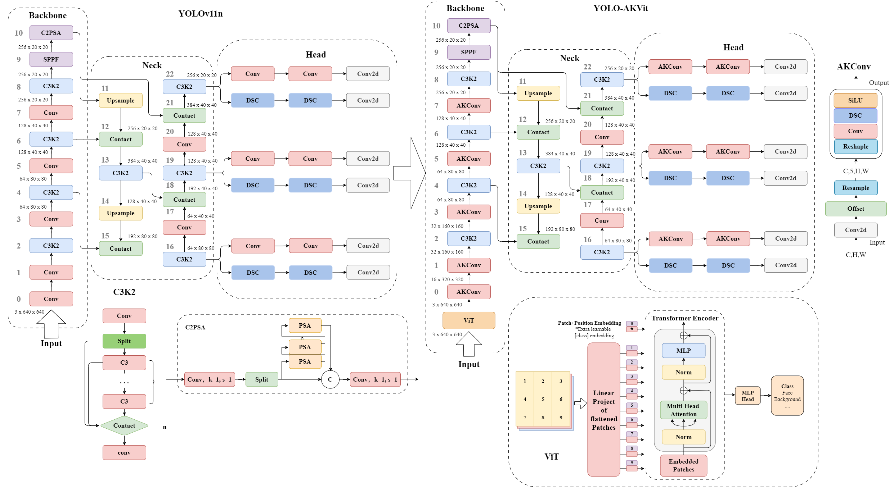

<div align="center">
    
</div>
<br>


## Abstract

This study addresses the challenges of high latency and missed detections in high-density and multi-target face detection scenarios under complex environments. An improved YOLOv11n architecture is proposed by integrating AKConv adaptive kernel convolution and Vision Transformer modules into the backbone network. The proposed framework enhances global feature extraction capability while significantly reducing parameter redundancy and computational complexity. Experimental results demonstrate improved detection accuracy and model lightweighting performance on custom datasets.

## Key Contributions

* Proposed an improved YOLOv11n architecture integrating AKConv and ViT modules
* Enhanced global feature representation using self-attention mechanisms
* Reduced model parameters while maintaining high detection accuracy
* Improved robustness in multi-target and dense face detection scenarios


```
@inproceedings{yu2025yolov11vit,
  author    = {Liu-Yi Yu and Yan-Zuo Chang and Fu-Ping Guo and Lin-Po Shang and Yi Chen and Yu Liu and Yi-Ling Pan},
  title     = {Face Detection Study Based on YOLOv11n Improved ViT with AKConv},
  booktitle = {2025 IEEE 7th International Conference on Communications, Information System and Computer Engineering (CISCE)},
  year      = {2025},
  address   = {Guangzhou, China},
  pages     = {},
  doi       = {10.1109/CISCE65916.2025.11065738},
  keywords  = {YOLOv11, Vision Transformer, AKConv, Face Detection, Computer Vision}
}

```